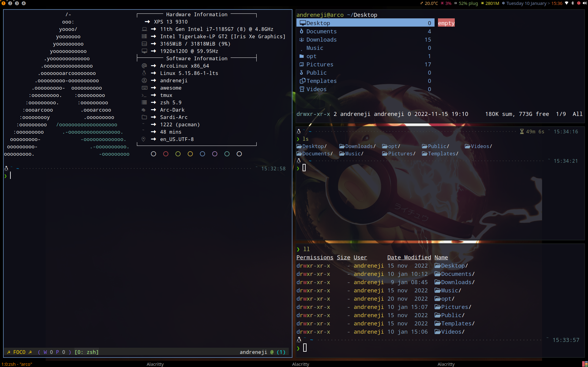
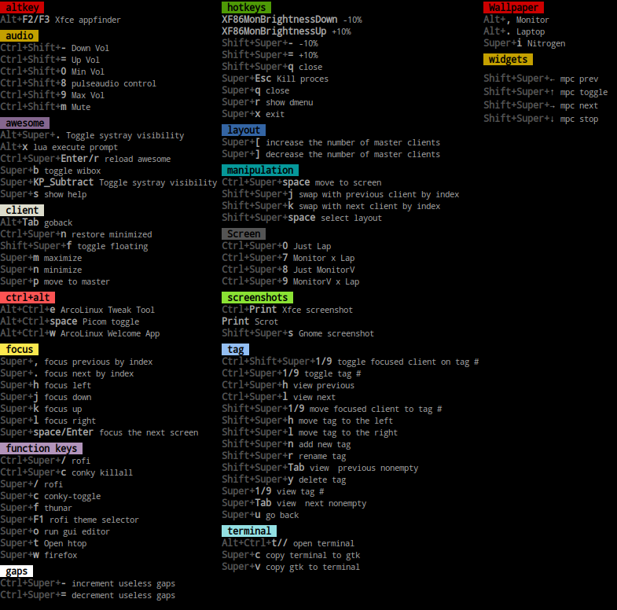

# AwesomeWM



### Hotkeys



## Installing

You will need [git](https://git-scm.com/downloads) 

Clone Repo

```bash
git clone https://github.com/andreneji/awesome.git
```

Clone into directory `~/.config/` 

or

You will need [git](https://git-scm.com/downloads) and GNU [stow](https://www.gnu.org/software/stow/manual/stow.html)

Clone into directory `~/.dotfiles/Awesome/.config/`

Run `stow` to symlink:

```bash
cd ~/.dotfiles
stow -vv Awesome 
```

## Dependences

- I'm using:
- [Distro - ArcoLinuxD](https://ftp.belnet.be/arcolinux/iso/index.html) and 
- [Scripts](https://github.com/andreneji/Scripts.git)

## References

- [TWM Linux - Gabriel](https://github.com/GabrielTWMlinux)
